# Hi There! 👋 I'm Vikrant (a.k.a. hexavik)

🚀 Embedded Systems & Software Developer | 🎨 Sketch Artist | 📖 Tech Blogger  
Passionate about **C++, Rust, Embedded Systems, Graphics Programming, and Problem-Solving**.

<!-- Socials -->
## 🌐 Connect with Me

## 🛠️ Tech Stack

## 💼 Experience

| 👨‍💻 Role | 📍 Company | 📆 Duration |
|------|---------|----------|
| Software Engineer III | *Forcepoint* | Aug 2023 - Jan 2025 |
| Senior Lead Engineer | *Econote Technology Pvt. Ltd.* | Apr 2022 - May 2023 |
| Lead Engineer | *Econote Technology Pvt. Ltd.* | Jan 2021 - Mar 2022 |
| Senior Embedded Engineer | *Econote Technology Pvt. Ltd.* | Feb 2020 - Dec 2020 |
| Embedded Systems Engineer | *Prescientech Innovators* | May 2018 - Feb 2020 |
| Founder & Principal Engineer | *Cubez Technocrats Pvt. Ltd.* | Jan 2014 - Apr 2018 |
| Freelancer | *Self Employed* | Nov 2012 - Dec 2013 |
| Firmware Developer | *Campus Component Pvt. Ltd.* | June 2011 - Sep 2012 |

## ⏳ Coding Activity

<!-- Wakatime stats -->

